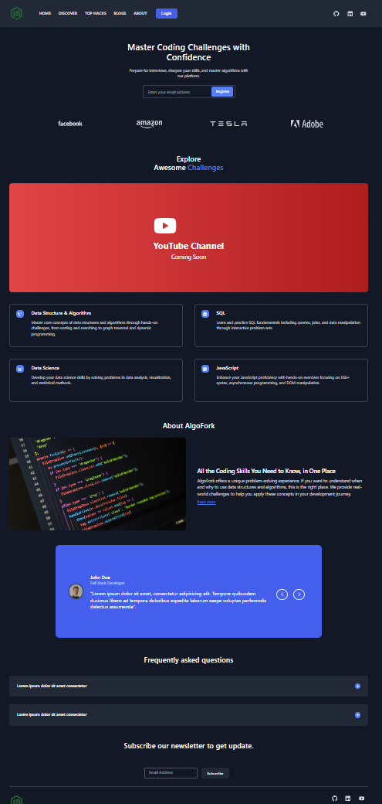

# AlgoFork

## Overview

AlgoFork is a website designed to offer an engaging and practical problem-solving experience for developers. Whether you're a beginner or a seasoned coder, AlgoFork helps you understand the when and why behind using data structures and algorithms by applying them to real-world challenges. The website offers free resources for improving your coding skills, focusing on real-world scenarios to make learning practical and relevant.

The website can be accessed via the following link:

**[Live Website](https://algo-fork-4vsv0yhvz-engenmes-projects.vercel.app/)**

<div>
  
</div>

## Table of Contents

- [Features](#features)
- [Code Structure](#code-structure)
- [Prerequisites](#prerequisites)
- [Installation](#installation)
- [Configuration](#configuration)
- [Running the Application](#running-the-application)
- [Technologies Used](#technologies-used)
- [Contributing](#contributing)
- [License](#license)

## Features

- Real-world Coding Challenges: Solve problems that simulate real-life coding scenarios.
- Focus on Data Structures & Algorithms: Learn when and why to use specific data structures and algorithms.
- Interactive Tutorials: Step-by-step guides to help users solve problems.
- Responsive Design: The website is fully responsive, ensuring an optimized experience across devices.
- Dark Mode Toggle: Switch between light and dark themes.

## Code Structure

```bash
 App.tsx
│   index.css
│   main.tsx
│   vite-env.d.ts
│
├───assets
│       codeOnScreen.avif
│       WebsiteLandingPage.png
│
└───components
    │   About.tsx
    │   Discover.tsx
    │   Faqs.tsx
    │   Footer.tsx
    │   Hero.tsx
    │   NavBar.tsx
    │   Reviews.tsx
    │   socialMediaItems.tsx
    │
    └───UI
        ├───Discover
        │       Cards.tsx
        │       Icon.tsx
        │       Text.tsx
        │       Title.tsx
        │       YoutubeChannel.tsx
        │
        ├───Faqs
        │       Card.tsx
        │       ExpandedBtn.tsx
        │       ShrinkedBtn.tsx
        │       Title.tsx
        │
        ├───Footer
        │       Input.tsx
        │       SubscribeBtn.tsx
        │       SubscriptionField.tsx
        │       Title.tsx
        │
        ├───Hero
        │       AdobeLogo.tsx
        │       AmazonLogo.tsx
        │       FacebookLogo.tsx
        │       Icons.tsx
        │       Input.tsx
        │       SubTitle.tsx
        │       TeslaLogo.tsx
        │       Title.tsx
        │
        ├───NavBar
        │       LoginButton.tsx
        │       Logo.tsx
        │       MenuButton.tsx
        │       MenuItems.tsx
        │       SocialMedia.tsx
        │
        └───Reviews
                Body.tsx
                Buttons.tsx
                Card.tsx
                PersonPic.tsx
                Title.tsx
```

## Prerequisites

- Node.js v14 or higher
- npm or yarn
- Vite (if developing locally)

### Installation

1. **Clone the Repository**

```bash
git clone https://github.com/EngenMe/AlgoFork.git
cd AlgoFork
```

2. **Install dependencies**

```bash
npm install
# or if you use yarn
yarn install
```

## Configuration

No additional API configuration is required at this time.

## Running the Application

- Development Mode

```bash
npm run dev
# or if using yarn
yarn dev
```

This will start the development server and the app will be available at `http://localhost:{your-port}`

## Technologies Used

- Frontend: React, TypeScript
- State Management: React Hooks (with custom hooks)
- Styling: CSS Modules
- Build Tool: Vite
- Utilities: Immer, Lodash

## Contributing

Feel free to fork the repository and submit pull requests for any improvements or bug fixes. Contributions are always welcome!

## License

This project is licensed under the MIT License - see the **[LICENSE](./LICENSE)** file for details.
